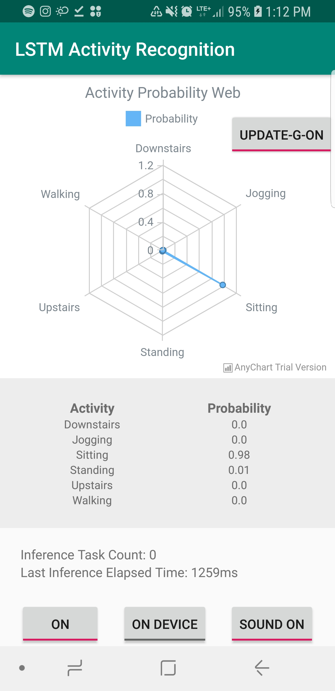
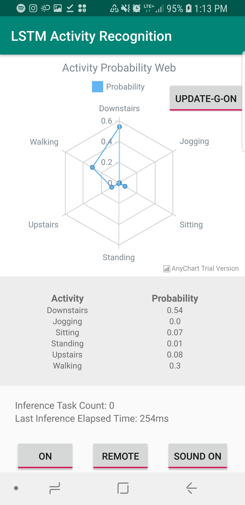
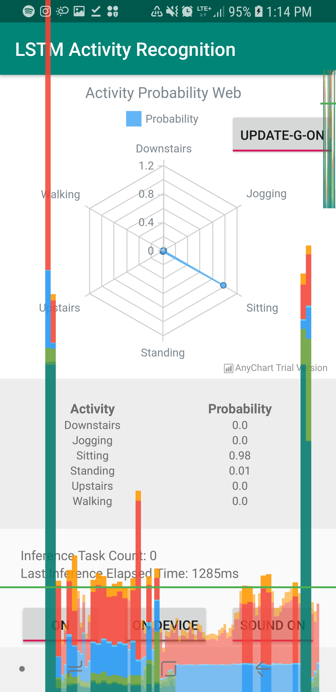
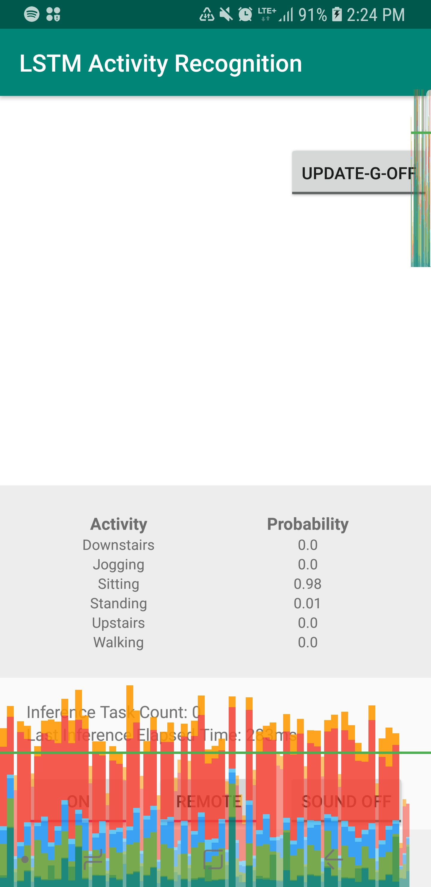

# LSTM Activity Recognition - Final Project

Author: Adonay Resom

## Introduction

This design document/tutorial explains the development of an Android application 
that can use deep learning to detect a users current physical activity.

### **Requirements**

* **Java**
* **Android Studio**
* **Python**
    * Python 2 needed for performance analysis
    * Python 3 needed for Tensorflow
* **Google Cloud Platform** (to create remote server)

<sup>Knowledge on how to use technologies listed above is also required (eg. knowledge of using Android libraries)</sup>

### **What you'll learn**

* How to collect sensor data
* How to run inferences on a frozen tensorflow model (proto buffer)
    * On Device (locally on Android)
    * On a Python (flask) server
* How to communicate with remote server using OkHttp
* How to use android text-to-speech to announce inference results
* How to deploy a python server on a Google Cloud Engine VM Instance
* and more ...

Non-relevant concepts and code blocks are glossed over and are provided for you to simply copy and paste.


## Getting set up

### **Create a New Project**

* Create a new project.

### **Adding in the required Dependencies**

There are several files and configurations you will need to add or edit inorder to start development. 
Successfully complete the following tasks to get started:

* Create a **libs** folder under the app folder and add the files found in the "libraries_used" folder in this submission
 to the libs folder you created

* Right click on your **app** folder in Android studio and click on New &rarr; Folder &rarr; Assets Folder in order to 
create an assets folder. After creating the folder, add the proto buffer (.pb) model file from the "model_used" folder
in this submission, into the assets folder. 

* Navigate to the build.Gradle (app) and :

    * add the following to the android section
        ```
        sourceSets {
            main {
                jniLibs.srcDirs = ['libs']
            }
        }
        ```    
        
    * add the following to the dependencies section
        ```
        implementation 'com.squareup.okhttp:okhttp:2.7.5'
        implementation 'com.google.code.gson:gson:2.8.5'
        implementation files('libs/libandroid_tensorflow_inference_java.jar')
        androidTestImplementation 'com.android.support.test.espresso:espresso-core:3.0.2'
        ```
        
    * add the following permissions to the AndroidManifest.xml file
        ```
        <uses-feature android:name="android.hardware.sensor.accelerometer" android:required="true"/>
        <uses-permission android:name="android.permission.INTERNET"/>
        ```        

## Collecting sensor data and preparing for inference

### **Collecting sensor data**    

* Implement the **SensorEventListener** Interface in the **MainActivity** class

    To use the interface and collect data we will need the following methods and variables
    
    ```
    private SensorManager getSensorManager() {
        return (SensorManager) getSystemService(SENSOR_SERVICE);
    }
    protected void onPause() {
        getSensorManager().unregisterListener(this);
        super.onPause();
    }

    protected void onResume() {
        super.onResume();
        getSensorManager().registerListener(this, getSensorManager().getDefaultSensor(Sensor.TYPE_ACCELEROMETER), SensorManager.SENSOR_DELAY_GAME);
    }
    
    @Override
    public void onSensorChanged(SensorEvent event) {
    }

    @Override
    public void onAccuracyChanged(Sensor sensor, int i) {

    }
    ```
    
* To store the data collected add or edit the following variables and methods
    ```
    private static final int N_SAMPLES = 200;
    private static List<Float> x;
    private static List<Float> y;
    private static List<Float> z;
    private boolean isInferenceOn = false;
    private TextView inferenceTaskCounterTextView;
    private TextView inferenceElapsedTimeTextView;
    private int inferenceCounter = 0;
    ```
    
    Create TextView(s) in the layout XML file and attach them to View classes above in the **onCreate()** method. This
    documentation assumes you know how to do this and will expect you to individually handle layout elements from this
    point onwards. (If you find this hard use layout file found in submission)
    
    Edit the **onSensorChanged()** method to collect data and make predictions
    
    ```
    @Override
        public void onSensorChanged(SensorEvent event) {
            if(isInferenceOn){
                if (x.size() == N_SAMPLES && y.size() == N_SAMPLES && z.size() == N_SAMPLES) {
                    inferenceCounter++;
                    inferenceTaskCounterTextView.setText("Inference Task Count: " + inferenceCounter);
                    activityPrediction();
                }
                x.add(event.values[0]);
                y.add(event.values[1]);
                z.add(event.values[2]);
            }
        }
    ```
    
    The boolean **isInferenceOn** is attached to a toggle on the users screen that enables the user to stop collecting
    sensor data and making inferences. If the turns on the toggle the application will collect sensor data until it
    has enough samples to make an inference (represented by **N_SAMPLES**). Once it has enough samples it calls 
    **activityPrediction()**.
    
### **Preparing for predictions**    

* The **activityPrediction()** method

    Prediction process starts at the **activityPrediction()** method. The prepares sensor data in a format that the classifier can 
    understand (refer to the table in the **TensorFlowClassifier** section of the next step) and also executes the 
    **RunInferenceAsync** class that processes out inference in the background. **toFloatArray** is a helper method that 
    converts **List<float>** heirarchy to **float[]**.

    ```
    private void activityPrediction() {
        List<Float> data = new ArrayList<>();
        data.addAll(x);
        data.addAll(y);
        data.addAll(z);

        TextView[] probTextViewsArray = {downstairsTextView, joggingTextView, sittingTextView, standingTextView, upstairsTextView, walkingTextView};

        long startTime = SystemClock.uptimeMillis();
        RunInferenceAsync inferenceAsync = new RunInferenceAsync(this, probTextViewsArray, startTime, isRemote);
        inferenceAsync.execute(toFloatArray(data));

        x.clear();
        y.clear();
        z.clear();
    }
    
    private float[] toFloatArray(List<Float> list) {
        int i = 0;
        float[] array = new float[list.size()];

        for (Float f : list) {
            array[i++] = (f != null ? f : Float.NaN);
        }
        return array;
    }
    
    ```
## Making inferences

### **TensorFlowClassifier class**
This class will be used as an interface between java and the frozen model. It will allow us to take sensor data from
the device and classify (make an inference) on the device (locally) in order to figure out the probability of the user's
current activity. Follow the following instructions to successfully implement this local classifier:

* Create a **TensorFlowClassifier** class in Java

* Load the tensor flow library
    ```
    static {
        System.loadLibrary("tensorflow_inference");
    }
    ```
    
* Add tensorflow graph configurations and prediciton method

    Firstly, add create the constants (configurations) that are needed to run your specific type of inference from the
    model stored in the **assets** folder.
    
    ```
    private TensorFlowInferenceInterface inferenceInterface;
    private static final String MODEL_FILE = "file:///android_asset/frozen_model.pb";
    private static final String INPUT_NODE = "inputs";
    private static final String[] OUTPUT_NODES = {"y_"};
    private static final String OUTPUT_NODE = "y_";
    private static final long[] INPUT_SIZE = {1, 200, 3};
    private static final int OUTPUT_SIZE = 6;

    public TensorFlowClassifier(final Context context) {
        inferenceInterface = new TensorFlowInferenceInterface(context.getAssets(), MODEL_FILE);
    }
    ```
    
    Then create the method that will be used to predict probabilities
    ```
    public float[] predictProbabilities(float[] data) {
        float[] result = new float[OUTPUT_SIZE];
        inferenceInterface.feed(INPUT_NODE, data, INPUT_SIZE);
        inferenceInterface.run(OUTPUT_NODES);
        inferenceInterface.fetch(OUTPUT_NODE, result);

        return result;
    }
    ```
    You can now use this method to predict activities provided that you feed it a 2 dimensional float array containing 
    3 elements in the first dimension (each for sensor vector readings **X, Y, Z**) and 200 elements in the second dimension
    for readings from each vectors. The following represents the array
    
    |   X  |   Y  |   Z  |
    |:----:|:----:|:----:|
    | 0... | 0... | 0... |
    | 0... | 0... | 0... |
    | 0... | 0... | 0... |
    
    <sup> * 0... represents a sensor float reading</sup>
    
    The method then returns a one dimensional float array containing the probability of each activity relative to the
    label array found in the **RunInferenceAsync** class (shown below).

### **RunInferenceAsync class**

This class is used to process inference/classification in the background. It also updates the user through elements 
on the screen and through speech (audio) with results from the inference.

* Constructing class 

    Use the following code to create the overall structure of the class
    ```
    public class RunInferenceAsync extends AsyncTask<float[], Float, float[]>{
        private final static String TAG = "RunInferenceAsync";
    
        private String resultMessage = "Nothing happened";
        private OkHttpClient client;
        private ArrayList<WeakReference<TextView>> weakProbTextViews;
        private long startTime;
        private float[] results;
        private String[] labels = {"Downstairs", "Jogging", "Sitting", "Standing", "Upstairs", "Walking"};
        private boolean isRemote;
        private TensorFlowClassifier classifier;
        private OnInferenceCompleted inferenceCompletedListener;
    
        //  private static final String hosturl = "http://10.0.2.2:54321/predict"; // on local server w emulator
        //  private static final String hosturl = "http://192.168.1.4:54321/predict"; // on local server w usb phone
        private static final String hosturl = "http://35.243.255.62:54321/predict"; // on remote server
    
        RunInferenceAsync(MainActivity mainActivity, TextView[] probTextViewArray, long startTime, boolean isRemote){
            Context context = mainActivity.getApplicationContext();
            this.inferenceCompletedListener = mainActivity;
            this.weakProbTextViews = new ArrayList<>();
            for(TextView textView: probTextViewArray){
                this.weakProbTextViews.add(new WeakReference<>(textView));
            }
            this.startTime = startTime;
            this.isRemote = isRemote;
        }
    
        protected void onPreExecute() {
        }
    
        protected float[] doInBackground(float[]... sensorData) {    
            return results;
        }
    
        protected void onPostExecute(float[] results){
        }
    
        private static float round(float d, int decimalPlace) {
            BigDecimal bd = new BigDecimal(Float.toString(d));
            bd = bd.setScale(decimalPlace, BigDecimal.ROUND_HALF_UP);
            return bd.floatValue();
        }
    
        private int getHighestIndex(){
            if (results == null || results.length == 0) {
                return -1;
            }
            float max = -1;
            int idx = -1;
            for (int i = 0; i < results.length; i++) {
                if (results[i] > max) {
                    idx = i;
                    max = results[i];
                }
            }
    
            return idx;
        }
    }
    
    ```

* Making local inferences

    To make local inferences, firstly add the following code to the **onCreate()** method. The code creates an instance of 
    the local Tensorflow classifier we created. 
    ```
    if (!this.isRemote){
        classifier = new TensorFlowClassifier(context);
    }
    ```
    
    The **isRemote** variable is attached to a toggle on the users screen that enables the user to switch between
    performing local and remote inferences. For this purpose the toggle should be set to false or "On Device".
    
    Then add the following to the **doInBackground()** method inorder to make a local inference. 
    
    ```
    protected float[] doInBackground(float[]... sensorData) {
        if(!isRemote){
            results = classifier.predictProbabilities(sensorData[0]);
        }else{
        }
    ```

* Making remote inferences
    
    To make a remote inference you will need to prepate the **OkHttpClient** class that handles the communication to the
    server. Edit the **onPreExecute()** method to following:
    ```
    if(isRemote){
        final int timeout = 30;
        client = new OkHttpClient();
        client.setConnectTimeout(timeout, TimeUnit.SECONDS);
        client.setWriteTimeout(timeout,TimeUnit.SECONDS);
        client.setReadTimeout(timeout,TimeUnit.SECONDS);
    }
    ``` 
    
    Then edit the **doInBackground()** method to handle the communication between the phone and the server:
    ```
    protected float[] doInBackground(float[]... sensorData) {
        if(!isRemote){
            results = classifier.predictProbabilities(sensorData[0]);
        }else{
            Gson gson = new Gson();
            String jsonSensorData = gson.toJson(sensorData);

            RequestBody requestBody = new MultipartBuilder()
                    .type(MultipartBuilder.FORM)
                    .addFormDataPart("x", jsonSensorData)
                    .build();

            Request request = new Request.Builder()
                    .url(hosturl)
                    .post(requestBody)
                    .build();

            try {
                Response response = client.newCall(request).execute();
                resultMessage = response.body().string();
            } catch (IOException e) {
                Log.d(TAG, e.toString());
            }

            String stringProbabilities = "";

            try {
                JSONObject jsonObject = new JSONObject(resultMessage);
                stringProbabilities = jsonObject.getString("y");
            } catch (JSONException e) {
                e.printStackTrace();
            }

            stringProbabilities = stringProbabilities.substring(2, stringProbabilities.length()-2);

            String[] splitMessage = stringProbabilities.split(",");
            results = new float[splitMessage.length];

            for(int i = 0; i < splitMessage.length; i++){
                results[i] = Float.parseFloat(splitMessage[i]);
            }
        }

        return results;
    }
    ```

* Handle the result generated by inference/classification

    Making an inference returns an array of probabilities (a float array). To make sense of this data and display it to
    the user, edit the onPostExecute() method to the following:
    
    ```
    protected void onPostExecute(float[] results){
        long elapsedTime = SystemClock.uptimeMillis() - startTime;
        for(int i = 0; i < weakProbTextViews.size(); i++){
            TextView textView = weakProbTextViews.get(i).get();
            if(textView!=null){
                textView.setText(Float.toString(round(results[i], 2)));
            }
        }
        int highestIndex = getHighestIndex();

        inferenceCompletedListener.onInferenceCompleted(labels[highestIndex], results[highestIndex], elapsedTime);
    }
    ```
    
    The **inferenceCompletedListener.onInferenceCompleted()** method above notifies the MainActivity with details about
    the inference (such as elapsed time and a string of the highest probable activity).
    

* Implementing Text-to-speech and notifying user about results
    Implement **OnInferenceCompleted** and **TextToSpeech.OnInitListener** interfaces to the MainActivity and also add 
    the following code into the class (this enable Text-to-speech and other UI updates).
    
    ```
    private TextToSpeech textToSpeech;
    
    protected void onPause() {
        getSensorManager().unregisterListener(this);
        if(textToSpeech !=null){
            textToSpeech.stop();
            textToSpeech.shutdown();
        }
        super.onPause();
    }
    
    @Override
    public void onInit(int status) {
        if(status != TextToSpeech.ERROR) {
            textToSpeech.setLanguage(Locale.US);
        }
    }
    
    @Override
    public void onInferenceCompleted(String activity, float probability, long elapsedTime) {
        inferenceCounter--;
        inferenceTaskCounterTextView.setText("Inference Task Count: " + inferenceCounter);
        inferenceElapsedTimeTextView.setText("Last Inference Elapsed Time: " + elapsedTime + "ms");
        textToSpeech.speak(activity, TextToSpeech.QUEUE_ADD, null, Integer.toString(new Random().nextInt()));
    }
    
    ```
    
## Deploying python flask server

Use the following code to get the graph from the model file (.pb) and serve through a python flask server:

```
import json, argparse, time
import tensorflow as tf
from flask import Flask, request

app = Flask(__name__)


@app.route("/predict", methods=['POST'])
def predict():
    start = time.time()

    data = request.data.decode("utf-8")
    if data == "":
        params = request.form
        x_in = json.loads(params['x'])
    else:
        params = json.loads(data)
        x_in = params['x']

    print("Received:")
    print(x_in)

    # Tensor flow part
    y_out = persistent_sess.run(y, feed_dict={
        x: [x_in]
    })
    # END Tensor flow part

    json_data = json.dumps({'y': y_out.tolist()})
    print("Time spent handling the request: %f" % (time.time() - start))

    return json_data


def load_graph(frozen_graph_filename):
    # We load the protobuf file from the disk and parse it to retrieve the
    # unserialized graph_def
    with tf.gfile.GFile(frozen_graph_filename, "rb") as f:
        graph_def = tf.GraphDef()
        graph_def.ParseFromString(f.read())

    # Then, we import the graph_def into a new Graph and returns it
    with tf.Graph().as_default() as graph:
        # The name var will prefix every op/nodes in your graph
        # Since we load everything in a new graph, this is not needed
        tf.import_graph_def(graph_def, name="prefix")
    return graph


if __name__ == "__main__":
    parser = argparse.ArgumentParser()
    parser.add_argument("--frozen_model_filename", default="frozen_model.pb", type=str,
                        help="Frozen model file to import")
    parser.add_argument("--gpu_memory", default=.2, type=float, help="GPU memory per process")
    args = parser.parse_args()

    # Tensor flow part
    print('Loading the model')
    graph = load_graph(args.frozen_model_filename)
    x = graph.get_tensor_by_name('prefix/inputs:0')
    y = graph.get_tensor_by_name('prefix/y_:0')

    print('Starting Session, setting the GPU memory usage to %f' % args.gpu_memory)
    gpu_options = tf.GPUOptions(per_process_gpu_memory_fraction=args.gpu_memory)
    sess_config = tf.ConfigProto(gpu_options=gpu_options)
    persistent_sess = tf.Session(graph=graph, config=sess_config)
    # END Tensor flow part

    print('Starting the API')
    app.run(host='0.0.0.0', port=54321)
```

After copying this code into a python script file (for example a file called "server.py"). Use the tutorial in the
following link to create a Google Compute Engine powered online virtual machine instance that allows you to run the
python server:

<https://wpimobile18b.github.io/tutorials/DeepInference/#0>

Upload the server.py and frozen_model.pb file to the VM machine and run the server using the following in the bash CLI.
Remember to run tmux before running the server.

First

```
tmux
```

Then

```
python server.py
```

You are done! Your server now runs remotely. Use the link provided in the Google console along with the route set in
python file to access it as an endpoint.


# Performance Evaluation for LSTM Activity Recognition Application - Team1010 Final Project

## Measurement methodology

Tests will be carried out while interacting with the toggles on screen. The toggles adds or removes certain features 
in the application in order to learn more about how each feature affects the various performance metrics listed below.
While doing manual analysis, timing of tests are determined by the amount of time it takes the device and/or application
to exhibit a visible level of change or pattern in performance metrics in response to our input. Automated tests are
done across the same time for all tests (10 seconds usually)

## Performance Metrics (manual analysis)

### **Inference Time**

Inference time varies greatly between On-Device and Off-Device classification/inference. Off device classification
tends to be much faster than On-Device inference. 

On-Device inference tends to be in between 1100ms and 1300ms long, while Off-Device inference tends to be between 100ms 
and 200ms most of the time. Inference time was reported using both logcat (initially) and through on screen updates.s

<p>
  
   
</p>

### **CPU, Network, Energy (Battery)**

The following are screen shots taken from the Android profiler while using the app

* On-Device Inference


 
During on-device inference most resources listed (expect Network) have synchronous periodic peaks or dips (at the same time)

The memory is used constantly while showing slight dips during inferences. This is mainly because the variables holding
the sensor values are always getting filled except when they are cleared after each inference.

On the other hand, Energy and CPU experience syncronous peaks. The graph generated above also shows that energy usage is 
affected more than CPU during inferences. This could be because inferences require more than just CPU usage (for example
sensor usage). I could mean that our application might not be battery efficient.


* Off-Device Inference


The graph above shows that off device inference is considerably more efficient than on device inference. The CPU and
Memory usages are almost never affected during inference times. The energy usage is also considerably more efficient. 
The only peaks we notice come from Network usage (which is expected). It is also noticable that noetwork usage has some
effects on energy usage (some energy peaks after network peaks are visible).

* Comparision

| Metrics        | On-Device                                      | Off-Device       |
|----------------|------------------------------------------------|------------------|
| Inference Time |                  1100ms-1300ms                 |    100ms-200ms   |
| CPU            |                   High usage                   | Very small usage |
| Network        |                    No usage                    |    High usage    |
| Memory         |              Medium to High usage              |    Very small    |
| Energy         |                   High usage                   |    Small Usage   |
| GPU render     | Nearly same (sometimes higher than off-device) |    Nearly same   |

### **GPU rendering profile**

<p>
  
</p>

The peak bars clearly show that inference generates a high traffic of frames (which takes more time to render). The
peaks are specifically caused by redrawing the lines on the graph after each inference (because probability values 
change).

## Performance Metrics (automated scripts)

Automated scripts are found in the "test_scripts" folder that is in turn in the part2 folder.

run_perf_tests.py is used along with monkey runner inorder to run automated tests and generate trace

androidTest folder contains MainActivityTest class, which automates UI interaction with elements in the MainActivity

I have also attached a trace.html file along with the scripts.

# Improvements

* Removing the graph to improve GPU render speed

The following represents the rendering profile without
 the graph: 

<p>
  
</p>

There is a tremendous decrease of peak values experienced when the Graph view is removed 
from the application's activity (using the UPDATE-G-OFF toggle button). 

* Remove table layout and display in flat xml hierarchy.
* Avoid reloading graph for each inference. Find a lbrary that supports live graph updates without refresh.


## References

I used the following references while developing this application

* TensorFlow: How to freeze a model and serve it with a python API 

    <https://blog.metaflow.fr/tensorflow-how-to-freeze-a-model-and-serve-it-with-a-python-api-d4f3596b3adc>

* Human Activity Recognition using LSTMs on Android — TensorFlow for Hackers 

    <https://medium.com/@curiousily/human-activity-recognition-using-lstms-on-android-tensorflow-for-hackers-part-vi-492da5adef64>

