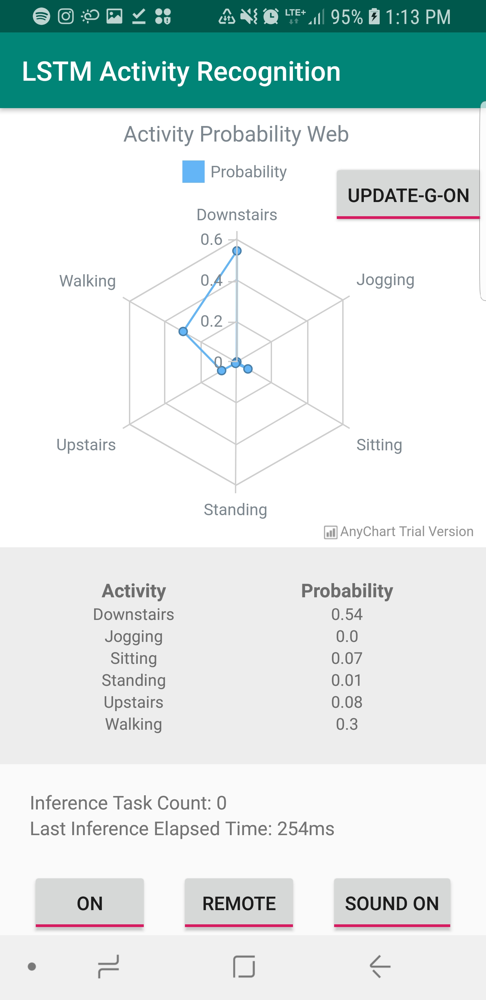

# Performance Evaluation for LSTM Activity Recognition Application - Team1010 Final Project

## Measurement methodology

Tests will be carried out while interacting with the toggles on screen. The toggles adds or removes certain features 
in the application in order to learn more about how each feature affects the various performance metrics listed below.
While doing manual analysis, timing of tests are determined by the amount of time it takes the device and/or application
to exhibit a visible level of change or pattern in performance metrics in response to our input. Automated tests are
done across the same time for all tests (10 seconds usually)

## Performance Metrics (manual analysis)

### **Inference Time**

Inference time varies greatly between On-Device and Off-Device classification/inference. Off device classification
tends to be much faster than On-Device inference. 

On-Device inference tends to be in between 1100ms and 1300ms long, while Off-Device inference tends to be between 100ms 
and 200ms most of the time. Inference time was reported using both logcat (initially) and through on screen updates.s

  
   

### **CPU, Network, Energy (Battery)**

The following are screen shots taken from the Android profiler while using the app

* On-Device Inference

 
During on-device inference most resources listed (expect Network) have synchronous periodic peaks or dips (at the same time)

The memory is used constantly while showing slight dips during inferences. This is mainly because the variables holding
the sensor values are always getting filled except when they are cleared after each inference.

On the other hand, Energy and CPU experience syncronous peaks. The graph generated above also shows that energy usage is 
affected more than CPU during inferences. This could be because inferences require more than just CPU usage (for example
sensor usage). I could mean that our application might not be battery efficient.

* Off-Device Inference

The graph above shows that off device inference is considerably more efficient than on device inference. The CPU and
Memory usages are almost never affected during inference times. The energy usage is also considerably more efficient. 
The only peaks we notice come from Network usage (which is expected). It is also noticable that noetwork usage has some
effects on energy usage (some energy peaks after network peaks are visible).

* Comparision

| Metrics        | On-Device                                      | Off-Device       |
|----------------|------------------------------------------------|------------------|
| Inference Time |                  1100ms-1300ms                 |    100ms-200ms   |
| CPU            |                   High usage                   | Very small usage |
| Network        |                    No usage                    |    High usage    |
| Memory         |              Medium to High usage              |    Very small    |
| Energy         |                   High usage                   |    Small Usage   |
| GPU render     | Nearly same (sometimes higher than off-device) |    Nearly same   |

### **GPU rendering profile**

  

The peak bars clearly show that inference generates a high traffic of frames (which takes more time to render). The
peaks are specifically caused by redrawing the lines on the graph after each inference (because probability values 
change).

## Performance Metrics (automated scripts)

Automated scripts are found in the "test_scripts" folder that is in turn in the part2 folder.

run_perf_tests.py is used along with monkey runner inorder to run automated tests and generate trace

androidTest folder contains MainActivityTest class, which automates UI interaction with elements in the MainActivity

I have also attached a trace.html file along with the scripts.

# Improvements

* Removing the graph to improve GPU render speed

The following represents the rendering profile without
 the graph: 

  

There is a tremendous decrease of peak values experienced when the Graph view is removed 
from the application's activity (using the UPDATE-G-OFF toggle button). 

* Remove table layout and display in flat xml hierarchy.
* Avoid reloading graph for each inference. Find a lbrary that supports live graph updates without refresh.
